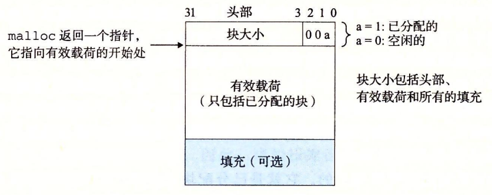

## part0 项目前置知识

- 物理内存是计算机实际存在的内存,一般是主存

- 虚拟内存是操作系统为每个进程分配的抽象内存，位于磁盘上

在使用时，虚拟内存会映射到物理内存上

假设cpu在处理该进程时，想要取一些值，会生成一个虚拟内存的地址，传递给cpu上的内存管理单元，内存管理单元在主存的页表中将该地址转化为物理内存地址

> 区分**显式**与**隐式**分配器

显式与隐式指的是内存申请与释放的方式

如c语言malloc申请内存，free释放内存，必须在代码中声明，程序并不会自动管理，这就是显式

在隐式分配器中系统会自动管理，无需手动释放，程序自动判断，这就是隐式

> 何为**有效荷载**

在申请的内存中，有的空间用来储存信息（该内存块是否被分配，内存块大小），有的还用来对齐，

我申请了990字节，实际分配了1000字节，那这990字节就是有效荷载，就是我要利用的

> 何为**内部**与**外部**碎片

- 实际空间 减去 有效荷载，剩下的就是内部碎片，其用来储存信息（该内存块是否被分配，内存块大小），有的还用来对齐

- 当我的程序申请了很多内存，又将其释放，这样内存会分为一段一段的，一段使用，一段空闲，我再申请一段空间时，尽管空闲块大小之和足够给出，但空闲块并不连续，此时就成了外部碎片

> 要求**吞吐量**和**内存利用率**

- 吞吐量是单位时间内处理的申请内存与释放内存数量，越高说明内存分配越快
- 内存利用率是实际被用的内存/总内存

> 它如何解决了前言中的一些问题？

- malloc从哪里分配的内存 : 从虚拟内存的堆内存中

- free只需要一个指针作为参数，它是怎么知道要释放多大的内存

  

malloc多会分配空间储存块大小与是否空闲，在返回的指针前面

## part1 从隐式空闲链表看起

首先分析代码

64位计算机cpu一次处理64位也就是8个字节，为了追求效率，每次读取的地址开始都最好为8的倍数，就是对齐

ALIGN(x) 就是把x向上取整为  ALIGNMENT(这里为8) 的倍数

这里的实现方法很巧妙 因为 $8=2^k$ 所以我们实际上是找第一个 > =x 且 最后三位是0的数

我们把除了最后三位变成0，我们先给最后三位都加上111，在&上000，把多加的减去

($...110 + 111 = (...+1)101$ 再把后面三位&掉，就是第一个 > =x 且 最后三位是0的数) 


其它的定义可以参考相同，这里注意一下GET_SIZE(p) 这里的p是头部而不是快开始的地方

扩展函数

```cpp
static void *extend_heap(size_t size) {
    size = (size-1)/ (CHUNKSIZE) * (CHUNKSIZE)+ (CHUNKSIZE); // 将扩展的大小调整为为CHUNKSIZE的整数倍（向上取整）
    void *curp;
    /*申请size空间*/
    if((curp = sbrk(size)) == (void*)(-1)){ // 申请堆失败
        fprintf(stderr,"sbrk failed:"); 
        return NULL;
    }
    PUT(HDRP(curp),PACK(size,0));// 把最后的结尾块信息覆盖为为新的空白快头部
    PUT(FTRP(curp),PACK(size,0));// 维护脚部
    PUT(HDRP(NEXT_BLKP(curp)),PACK(0,1)); // 在最后边放置结尾快
    coalesce(curp); // 将新的空白快合并一下
    return curp;
};
```

查询合适空闲块

```c
static void *find_fit(size_t size) {
    // debug 检查size是否双子对齐
    #ifdef DEBUG 
        if(size != ALIGN(size)) { // 检查size是否对齐到双位了
            fprintf(stderr,"extend_heap : param false");
        }
    #endif
    void *cur = heap_listp; 
    while((GET_SIZE(HDRP(cur))) !=0){ // 从cur开始一块一块扫
        // 筛选 未分配 && 大小足够
        if(GET_ALLOC(HDRP(cur)) == 0  \ 
           && GET_SIZE(HDRP(cur)) >= size){
                return cur;
            }
        cur = NEXT_BLKP(cur); // 跳到下一个块
    }
    return NULL;   // 未找到

}
```

将内存块分配给用户

```c
static void place(char *bp, size_t asize) {
    if(GET_SIZE(HDRP(bp)) == asize) {
        /*把头部和脚部标记上已经使用*/
        PUT(HDRP(bp),PACK(asize,1));
        PUT(FTRP(bp),PACK(asize,1)); 
        return ;
    } 
    size_t bsize = GET_SIZE(HDRP(bp)) - asize ; // 记录空白块size
    /*分配块更新头部和脚部*/
    PUT(HDRP(bp),PACK(asize,1));
    PUT(FTRP(bp),PACK(asize,1));
    /*空白快更新头部和脚部*/
    PUT(HDRP(NEXT_BLKP(bp)),PACK(bsize,0));
    PUT(FTRP(NEXT_BLKP(bp)),PACK(bsize,0));
    /*
        coalesce(NEXT_BLKP(bp)); 
        这里不需要合并空白快，因为开始的空白快的左右两侧一定是分配块，
        分配后不可能合并
    */
    return ;
}
```

用户申请内存

```c
void *mm_malloc(size_t size) {
    size = ALIGN(size + DSIZE); // 将size加上头部和尾部以后对齐
    void *cur = find_fit(size); // 寻找合适块
    /*扩展堆区，重新寻找*/
    if(cur == NULL) {
        if(extend_heap(size)==NULL){
            fprintf(stderr,"malloc error");
            return NULL;
        }
        cur = find_fit(size);
    }
    /*扩展堆区后仍未找到*/
    if(cur == NULL){
        fprintf(stderr,"malloc error");
        return NULL;
    }
    place((char * )cur,size);
    return cur;
}

```

合并空闲块

这里我的实现有些复杂 bp 表示当前空白块,尝试与左右合并

0,1表示块未使用/使用

分四种情况 (前面的块)0/1 bp (后面的块)0/1 

```c
static void *coalesce(void *bp) {

    //print_heap_blocks(1,"coalesce in");
    if(GET_ALLOC(bp) == 1){
        fprintf(stderr,"coalesce error");
        return NULL;
    }

    /*这里用0表示未分配1表示已分配，分四种情况讨论*/
    bool tag1 = GET_ALLOC(HDRP(PREV_BLKP(bp))); // 前一个块的分配情况
    bool tag2 = GET_ALLOC(HDRP(NEXT_BLKP(bp))); // 后一个块的分配情况
    size_t size;
    // 0 bp 0 
    if(!tag1 && !tag2){
        // size 为三者size 之和
        size = GET_SIZE(HDRP(PREV_BLKP(bp))) + GET_SIZE(HDRP(bp)) + GET_SIZE(HDRP(NEXT_BLKP(bp))); 
        /*切换状态为 bp 0 0 */
        bp = PREV_BLKP(bp); 
        PUT(HDRP(bp),size);
        PUT(FTRP(bp),size);
    }
    // 0 bp 1

    if(!tag1 && tag2){
        // size 为前两者size 之和
        size = GET_SIZE(HDRP(PREV_BLKP(bp))) + GET_SIZE(HDRP(bp)); 
        /*切换状态为 bp 0 1 */
        bp = PREV_BLKP(bp); 
        PUT(HDRP(bp),size);
        PUT(FTRP(bp),size);
    }

    // 1 bp 0

    if(tag1 && !tag2){
        // size 为后两者size 之和
        size = GET_SIZE(HDRP(bp)) + GET_SIZE(HDRP(NEXT_BLKP(bp))); 
        PUT(HDRP(bp),size);
        PUT(FTRP(bp),size);
    }
    // 1 bp 1
    // 无需合并
    //print_heap_blocks(1,"coalesce out");
    return bp;
}

```

释放内存块

```c
void mm_free(void *ptr) {
    /*更改状态 1 -> 0 */
    PUT(HDRP(ptr),PACK(GET_SIZE(HDRP(ptr)),0));
    PUT(FTRP(ptr),PACK(GET_SIZE(HDRP(ptr)),0));
    /*合并*/
    coalesce(ptr);
}
```

[运行结果](Part1/md/output.md)这里我保存了每次malloc或free后的堆作为输出

[Code](Part1/my_malloc.c)

我们自行测试一下效率

```
在20000次随机申请空间和释放中
my_malloc:
1.273107s 1.327486s 1.290223s
malloc(c语言提供)
0.023395s 0.021489s 0.022365s
```

可以看到比c语言自带的慢了很多，说明我们每次遍历所有块的效率是非常低的，当分配块增多时就会非常慢

# Part2

这里解释以下我新增的宏定义

```
// 得到前一个块的状态
#define GET_PRE_ALLOC(p) ((GET(p) & 0x2)>>1) 
// 取较小值
#define MIN(x, y) ((x) < (y) ? (x) : (y))
```

许多函数与Part1基本相同，这里介绍一下不一样的地方

- `delete_from_free_list` 这个是删除链表里的一个块，分为四种情况讨论

0/1表示前一个空闲内存块不存在/存在 

0/1 bp 0/1 

四种情况分别处理

```c
static void delete_from_free_list(void *bp){
    // 分四种情况 0/1表示前一个空闲内存块不存在/存在
    void *tag1 = GET_PRED(bp); // 前一个内存块
    void *tag2 = GET_SUCC(bp); // 后一个内存块

    // 1 bp 1
    if(tag1!=NULL && tag2!=NULL){
        SET_PRED(tag2,tag1);
        SET_SUCC(tag1,tag2);
        SET_PRED(bp,0);
        SET_SUCC(bp,0);
    }
    // 0 bp 0
    else if(tag1==NULL && tag2 ==NULL){
        SET_PRED(bp,0);
        SET_SUCC(bp,0);
        free_listp = NULL ;
    }
    // 1 bp 0 
    else if(tag1!=NULL && tag2==NULL){
        SET_SUCC(tag1,0);
        SET_PRED(bp,0);
        SET_SUCC(bp,0);
    }
    // 0 bp 1
    else {
        SET_PRED(tag2,0);
        free_listp = tag2;
        SET_PRED(bp,0);
        SET_SUCC(bp,0);
    }
    //print_heap_blocks(1,"delete_from_free_list_OUT");
    return ;
}
```

- `delete_from_free_list` 

  将一个块插入到链表首部，这里注意一下链表为空的情况就可以了

```c
static void add_to_free_list(void *bp){
    // 没有空闲块
    if(free_listp == NULL) {
        free_listp = bp;
        /*前驱后继都设置为0*/
        SET_PRED(bp,0);
        SET_SUCC(bp,0);
        return ;
    }
    /*将原来内存块前驱改为 bp*/
    SET_PRED(free_listp,bp);
    /*将 bp 后驱去 改为原链表头部*/
    SET_SUCC(bp,free_listp);
    /*将bp前驱设置为0*/
    SET_PRED(bp,0);
    free_listp = bp;
    return ;
}

```
- `coalesce`

这里的代码写的有点复杂，但大体思路没变

​		分为 4种情况 0/1为块未分配/分配 

​		0/1 bp 0/1

​		对于每种情况都是分为四步

​		链表删除 + 重算size  + 维护头部脚部 + 链表增添

```
  static void* coalesce(void* bp){
      /* 这里具体思路同part1 
      分为 4种情况 0/1为块未分配/分配
      分为四步 链表删除 + 重算size  + 维护头部脚部 + 链表增添
      */   
      bool tag1 = GET_PRE_ALLOC(HDRP((bp)));// 前一个块
      bool tag2 = GET_ALLOC(HDRP(NEXT_BLKP(bp)));// 后一个块
      //  0 bp 0 合并三个快
      if(!tag1 && !tag2){
          // 链表删除
          delete_from_free_list(PREV_BLKP(bp));
          delete_from_free_list(bp);
          delete_from_free_list(NEXT_BLKP(bp));
          // 重算size
          size_t  asize = GET_SIZE(HDRP(PREV_BLKP(bp))) + GET_SIZE(HDRP(bp)) + GET_SIZE(HDRP(NEXT_BLKP(bp))) ;
          // 维护头部脚部
          PUT(HDRP(PREV_BLKP(bp)),PACK(asize,GET_PRE_ALLOC(HDRP(PREV_BLKP(bp))),0));
          PUT(FTRP(PREV_BLKP(bp)),PACK(asize,GET_PRE_ALLOC(HDRP(PREV_BLKP(bp))),0));
          // 链表增添
          add_to_free_list(PREV_BLKP(bp));
      }else {
          if(!tag1 && tag2){// 0 bp 1 合并前两个
          //print_heap_blocks(1,"coalesce");
              // 链表删除
              delete_from_free_list(PREV_BLKP(bp));
              delete_from_free_list(bp);
              //print_heap_blocks(1,"coalesce");
              // 重算size
              size_t  asize = GET_SIZE(HDRP(PREV_BLKP(bp))) + GET_SIZE(HDRP(bp))  ;
              // 维护头部脚部((char *)(bp) - GET_SIZE(((char *)(bp) - DSIZE)))
              PUT(HDRP(PREV_BLKP(bp)),PACK(asize,GET_PRE_ALLOC(HDRP(PREV_BLKP(bp))),0));
              PUT(FTRP(PREV_BLKP(bp)),PACK(asize,GET_PRE_ALLOC(HDRP(PREV_BLKP(bp))),0));
              // 链表增添
              add_to_free_list(PREV_BLKP(bp));
              //print_heap_blocks(1,"coalesce");
          }
          else {
              if(tag1 && !tag2) {// 1 bp 0 合并后两个
                  // 链表删除
                  delete_from_free_list(bp);
                  delete_from_free_list(NEXT_BLKP(bp));
                  // 重算size
                  size_t  asize =  GET_SIZE(HDRP(bp)) + GET_SIZE(HDRP(NEXT_BLKP(bp))) ;
                  // 维护头部脚部
                  PUT(HDRP(bp),PACK(asize,GET_PRE_ALLOC(HDRP((bp))),0));
                  PUT(FTRP(bp),PACK(asize,GET_PRE_ALLOC(HDRP((bp))),0));
                  // 链表增添
                  add_to_free_list(bp);
              }
              else {// 1 bp 1无需操作
                  
              }
          }
      }
      return bp;
  }
```

- `place` 将一个块分配出去

  执行两个操作 切割 + 分配

  如果切割剩下的空白快大小太小(小于最小快大小) 我们就不在切割

  这里注意一下切割完了记得维护标记
```c\
static void place(void* bp, size_t asize){
    // 从空闲块中删除
    //print_heap_blocks(1,"place");
   // printf("%p\n",bp);
    delete_from_free_list(bp);

    // 首先切割块,这里空白快大小需要大于 2 * DSIZE 也就是最小快大小
        if(GET_SIZE(HDRP(bp)) - asize < MIN_BLK_SIZE){// 多的块不够最小块大小，我们直接分配到填充块，不再切割
            //这里在后面的块标记前一个块已经被已使用
            asize = GET_SIZE(HDRP(bp));
            PUT(HDRP(NEXT_BLKP(bp)),PACK(GET_SIZE(HDRP(NEXT_BLKP(bp))),1,GET_ALLOC(HDRP(NEXT_BLKP(bp)))));
            if(GET_ALLOC(HDRP(NEXT_BLKP(bp))) == 0 )
            PUT(FTRP(NEXT_BLKP(bp)),PACK(GET_SIZE(HDRP(NEXT_BLKP(bp))),1,GET_ALLOC(HDRP(NEXT_BLKP(bp)))));
        }
        else { // 切割
            // 计算空白快大小
            size_t bsize = GET_SIZE(HDRP(bp)) - asize;
             
            // 切割出分配块
            PUT(HDRP(bp),PACK(asize,GET_PRE_ALLOC(HDRP(bp)),1));
            PUT(FTRP(bp),PACK(asize,GET_PRE_ALLOC(HDRP(bp)),1));
            // 切割出空白快 + 插入链表 + 尝试合并 
            PUT(HDRP(NEXT_BLKP(bp)),PACK(bsize,1,0));
            PUT(FTRP(NEXT_BLKP(bp)),PACK(bsize,1,0));
            add_to_free_list(NEXT_BLKP(bp));
            coalesce(NEXT_BLKP(bp));
        }
    // 切割完成,标记使用
    PUT(HDRP(bp),PACK(GET_SIZE(HDRP(bp)),GET_PRE_ALLOC(HDRP(bp)),1));
    PUT(FTRP(bp),PACK(GET_SIZE(HDRP(bp)),GET_PRE_ALLOC(HDRP(bp)),1));
    return ;
}
```


[Code](Part2/my_malloc.c) 本地运行时注意复制定义文件 `my_malloc.h ` 和main函数 `main.c` 文件

[样例输出](Part2/output/output.md) 这里我保存了每次malloc或free后的堆作为输出

测试结果放在Part3了

# Part3 

这一部分考虑我们如何对程序进行测试

我的想法是会对内存分配器进行若干次操作(申请与释放)，计算内存分配器的得分

得分分为两部分，分别占据50%(满分100)

- 内存分配率，这一部分我们在程序每进行 $\frac{n}{10}$ 次操作后，计算一次申请的内存 / 实际占用内存,取平均数作为得分

- 分配时间，考虑以 $c$ 语言的 $malloc$ 函数作为基准,用 我的程序运行时间 / c语言的运行时间 * 100 作为分数

### 代码实现

-  `get_data.c` 

在该文件中我们会生成 $100,000$ 组申请与释放操作,作为随机的数据输入

`1 id cnt` 表示新增一个标号为 `id` 大小为 `size` 的内存块

`0 id` 表示释放一个标号为 `id` 的内存块

```c
#include <stdlib.h>
#include <stdio.h>
#include <time.h>
const int N = 100000;

void swap(int *a,int *b){
    int tmp = *a;
    *a = *b;
    *b = tmp;
}
// 随机打乱一个数组
void random_array(int n,int *a){
    for(int i=n;i>=2;i--){
        int x = rand() % (i) + 1;
        swap(&a[i],&a[x]);
    }
} 
int cnt , n ;
int a[1000005];
int main(){
    srand(time(0));
	// 先申请100个
    for(int i=1;i<=10000;i++){
        int size = rand()% 1000000;
        a[++n] = ++cnt;
        printf("1 %d %d\n",cnt,size);
    }

    for(int i=1;i<=N-10000;i++){
        int rd = rand()%2;
        if(rd==0 && n){ // 删除
            if(rand()%100 == 1) random_array(n,a);
            printf("0 %d\n",a[n--]);
        }else {//申请
            int size = rand()% 1000000;
            a[++n] = ++ cnt;
            printf("1 %d %d\n",cnt,size);
        }
        
    }

    return 0;
}
```

- `my_malloc_test.c` 

该文件将随机数据输入,用手写的malloc与free执行,并计算根据规则内存分配率和分配时间

```c
#include <stdio.h>
#include <stdlib.h>
#include <time.h>
#include "my_malloc.h"
#define M 100005
#define N 100000
void *a[M]; // 储存指针
unsigned long S[M]; // 储存大小
struct node{
    int opt,size,id; // 类型 大小 id
}t[M];
unsigned long sum; // 内存总和
int main(){
   
    for(int i=1;i<=N;i++){
        scanf("%d",&t[i].opt);
        if(t[i].opt==0) { // 删除操作
            scanf("%d",&t[i].id);
        }
        else {
            scanf("%d%d",&t[i].id,&t[i].size);
        }
    }
    clock_t begin_time = clock(); // 计算开始时间
    double rate =0; //内存分配率  
    mm_init();
    for(int i=1;i<=N;i++){
        if(t[i].opt==0) {
            mm_free(a[t[i].id]); // 删除
            sum -= S[t[i].id]; 
        }else {
            a[t[i].id] = mm_malloc(t[i].size); // 申请
            S[t[i].id] = t[i].size; // 储存大小
            sum += S[t[i].id]; 
        }
        if(N%(N/10) == 0){ // 计算内存分配率和
            rate += (double)(sum)/(double)(mm_mallinfo());
        }
    }
    clock_t end_time = clock(); 
    double run_time = (double)(end_time - begin_time) / CLOCKS_PER_SEC;// 计算时间
    rate = rate / 10.0;// 计算平均值
    printf("%.5lf %.5lf\n",run_time,rate);
    return 0;
}
```

- `std_malloc_test.c` 

这一部分与上面相同，只是调用的是c语言的 $malloc$ 和 $free$ ,同时不在计算内存分配率，只计算时间

- `mkaefile`

这里将 `my_mallloc.c` 文件编译成动态链接库,未来可以使用

同时编译生成 `data` 和两个测试文件

同时担任清理文件任务

```makefile
.PHONY : clean
all : libmy_malloc.so my_malloc_test std_malloc_test data
libmy_malloc.so: my_malloc.c 
	gcc -w -shared -o libmy_malloc.so my_malloc.c -fPIC
my_malloc_test: my_malloc_test.c my_malloc.c
	gcc -w -o my_malloc_test my_malloc_test.c  my_malloc.c
std_malloc_test: std_malloc_test.c
	gcc -o std_malloc_test std_malloc_test.c
data : get_data.c
	gcc -o data get_data.c

clean : 
	-rm -f my_malloc_test
	-rm -f data
	-rm -f std_malloc_test
	-rm -f my_malloc.so
	-rm -f my.txt
	-rm -f std.txt
	-rm -f in.txt
	-rm -f all
	-rm -f libmy_malloc.so
```

- `all.sh`

这一部分首先make文件，进行100次测试

每次测试计算分数，求和取平均值

最后清理过程中生成的文件

```shell
make
std_time=0 my_time=0 my_rate=0
# 进行100次测试
for ((i=1;i<=100;i++))
do
    echo "run No.$i"
    ./data > in.txt
    ./std_malloc_test < in.txt > std.txt 
    ./my_malloc_test < in.txt > my.txt   
    # 保存std_malloc的运行时间 
    while read -r num1 ; do
        std_time=$(echo "$std_time+$num1" | bc -l)
    done < std.txt
    # 保存my_malloc运行时间 
    while read -r num1 num2; do
        my_time=$(echo "$my_time+$num1" | bc -l)
        my_rate=$(echo "$my_rate+$num2" | bc -l)
    done < my.txt
done
echo "清理文件"
make clean
# 输出时间
echo "$my_time $std_time"
# 将stdtime作为基准
my_socre=$(echo "$std_time / $my_time * 100" | bc -l)
# 内存利用率 /100 次求均值 再*100作为分数 相当于不变
#my_rate=$(echo "$my_rate   " | bc -l)
echo "$my_socre $my_rate"
```

运行 `./all.sh`

分别对两种malloc函数评估我们得到以下输出文件

当我们将 $malloc : free $ 次数为 $1:1$ 的时候，

可以看到find_first速度更快，但分配率低

find_best速度慢但分配率高
```
分配时间得分              内存分配率得分
52.60716267573907152300 72.76714  // 每次寻找最近的块 find_first
25.54026827265261428900 86.92787  // 每次寻找最优的块 find_best
```

当 $malloc : free$ 次数为 $2:1$ 的时候,此时基本全为malloc，此时

```
分配时间得分              内存分配率得分
7.18350586874659947500 99.84868// 每次寻找最近的块 find_first
6.20034517935042066600 99.96667 // 每次寻找最优的块 find_best
```

内存分配率二者得分差不多，分配时间得分却都很低，也反映了该算法并没有完全平衡分配时间和分配内存率，存在缺陷

# 总结

在维护块头和块尾的时候细节非常重要，如果出现细节错误(比如对分配块更新了脚部(分配快没有脚部))，会出现一些不明所以的越界，调试非常困难,所以写代码时一定要先理清逻辑,最好画画图

用宏定义一定要想清楚参数

$GET\_SIZE(p)$ 传入的是头部的指针

$GET\_PRED(p)$ $NEXT\_BLKP(p)$ 传入的就是块头的指针

导致不注意的话很容易写出错误

并且程序还是需要大量数据测试,才能保证正确性

断断续续写了好几天，发现还是要多写注释，不然几天过后写得什么全忘了
